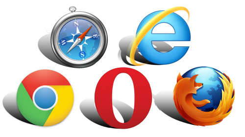
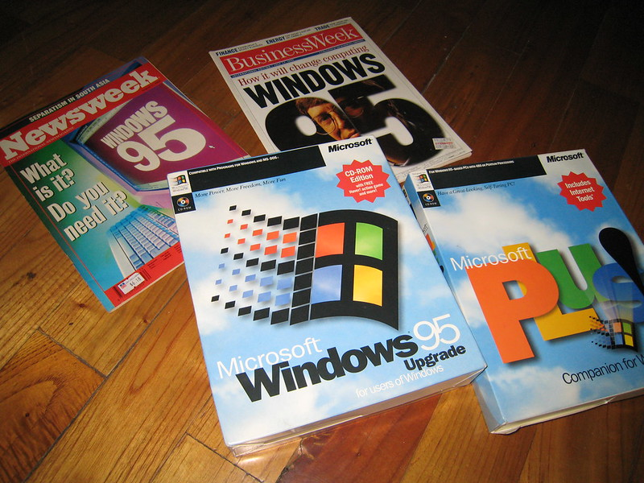

# The Browser War

On January 23, 1993, a computer program was released to the world. This program changed the way people thought about computers and the internet. This program along with the World Wide Web gave birth to a new economic trend and business model more lucrative than anything ever known. This program was called Mosaic Online - The first graphical web browser developed by Marc Andreessen and Eric Bina. The software spread on the internet like the word by mouth or in this case file transfer to file transfer. 

Soon after Mosaic became widely used, Jim Clark, co-founder of Netscape, took on the project to build the first commercial web browser, Netscape Navigator. The foundation of Netscape happened the same way many software companies start today. Jim Clark and Marc Andreessen (The Jobs and Wozniak of the browser war) recruited a team of developers to start the software company based on the Mosaic web browser. Aleks Totic, Rob McCool, Lou Montulli are two of the founding software engineers of Netscape. 

At the time of the rise of Netscape, Microsoft did not have a web browser yet. Like with much other software of the time, Microsoft’s business strategy was to create a copy of the commercial application and bundle it with Windows. If the user already has a web browser, mail application, and word processor, they will only need to buy the operating system. During the time of Netscape's rise, Microsoft was not invisible on the internet, they had Microsoft Network (MSN); an online service and Internet service provider. 

Microsoft was aware that Netscape was being developed and in December 15, 1994, Netscape Navigator was officially launched. By then, Microsoft was getting ready to launch is the biggest Operating System yet, Windows 95. Although Microsoft’s main revenue was the sale of Windows, the fast success of Netscape made Bill Gates understand that Web Browsing was the future of computers. Basically, the Web was suddenly a new software platform, and whoever owned it would have dominance over the playing field. For Microsoft, creating a web browser was no different than creating a word processor to compete with Lotus. In Bill Gates words:

The web was the single most important development in computing since the PC and Netscape is a new competitor born on the Internet, one that Microsoft has to match and beat.

Netscape new that Microsoft represented a problem, therefore, they hired an Anti-Trust Lawyer with experience in the field. Gary Reback immediately realized that Netscape had underestimated the Giant by assuming that Microsoft would obey the law. Soon after, Microsoft and Netscape had a meeting where Microsoft offered Netscape a 1-time payment of 1 million dollars for the source code of Netscape Navigator. If Netscape refuses, then Microsoft would write their own web browser and copy everything that Netscape did. Netscape did not buy into the anti-trust intimidation and immediately contacted Reback who then started a lawsuit against Microsoft.

For the first time, Microsoft had been challenged by a newcomer in a technology that Microsoft did not have a horse in yet. In Microsoft’s engineering room, every product was being built to destroy Netscape. On August 16, 1995, Microsoft launched Windows Internet Explorer as part of the add-on package Plus! for Windows 95. Microsoft strategy was simple: imitate everything that Netscape does and release update after update taking away market share a point at a time. It was a strategy that required capital and engineering power and Microsoft had both. Not only was Microsoft using engineering power but also it’s selling capabilities to undermine Netscape. Microsoft had the computer manufacturers’ side since all the computers came with Windows and Microsoft threatened computer manufacturers to not distribute Netscape with their computers or they will cancel their Windows license. These allowed Internet Explorer to start growing in popularity rapidly. 

Microsoft did not have to sell Internet Explorer, they simply bundle it with Windows. Unless the computer user was technologically savvy, they will think of buying/installing Netscape if a free equally good software was already installed for no extra cost. Eventually, Netscape was bought by AOL, and by 1997, the first phase of the browser war was over and Microsoft had become victorious. However, winning the war was the only good news Microsoft received. In 1998 The United States Government took Microsoft to court for anti-trust practices. Bill Gates was questioned and filmed regarding his actions and it was clear that Bill Gates was in deep waters. The judge verdict read that Microsoft was guilty of antitrust violations and recommended the breaking up of the company. Eventually, a federal appeals court agreed that Microsoft had violated the law but that the punishment of splitting the company was too harsh. Bill Gates stepped down from his position as CEO and handed the company to the Cancer of Steve Balmer. 
